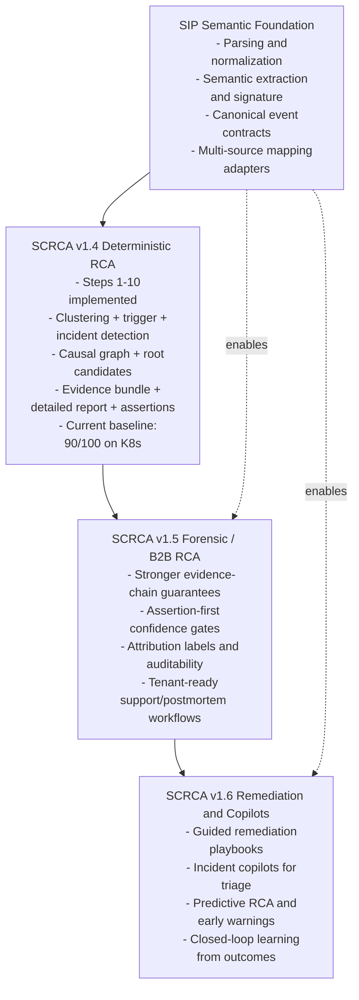

# Semantic Causal Root Cause Analysis (SCRCA)

## Technical Architecture Specification

**Version:** v1.4.3 (Consolidated)  
**System:** Semantic Root Cause Analysis Pipeline  
**Purpose:** Deterministic incident detection and root cause analysis from system logs using semantic normalization, behavioral clustering, and causal propagation analysis.

---

## 1) Executive Summary

SCRCA transforms raw logs into canonical events, detects anomaly-driven incidents, identifies likely root causes using deterministic scoring, and produces evidence-backed reports.

This consolidated version merges:

- Prior 12-stage architecture intent (deterministic + explanation + graph + narrative)
- Current implemented pipeline (Steps 1-10 in `main.py`)
- Latest forensic additions (evidence bundle, detailed report, assertions)
- Current quality baseline and source onboarding direction

Current validated baseline on K8s audit input: **90/100**.

---

## Vision Diagram (SIP -> SCRCA Evolution)

---

## 2) End-to-End Flow (Current + Planned)

Raw Logs  
-> Event Normalization  
-> Event Embeddings  
-> Behavior Clustering  
-> Trigger Analysis  
-> Incident Detection  
-> Causal Analysis (Graph + Root Candidates + Rooted Events)  
-> RCA Report  
-> Evidence Bundle  
-> Detailed RCA Report  
-> Incident Assertions  
-> (Planned) Incident-to-Incident Graph  
-> (Planned) LLM Narrative Summary

---

## 3) Implemented Pipeline Stages (1-10)

### Step 1: Event Extraction and Normalization

- **Command:** `python main.py ingest <logfile_or_dir>`
- **Script path:** `parsers/ingest_runner.py`
- **Input files:** raw `.log` files from single file or directory input
- **Input record forms:** K8s audit CSV, K8s audit JSON, generic app logs, support-bundle `all.logs` wrapped records
- **Fields consumed from raw records:** timestamp strings, actor/user fields, verb/action, resource/object, path/URI, stage/stream, status/response indicators, message text
- **Fields derived:** canonical event fields + normalized text + embedding text + semantic entity block + deterministic signature
- **Core output file:** `outputs/events.jsonl`
- **Output schema highlights (per event):**
  - identity/context: `event_id`, `source_type`, `timestamp`, `severity`, `service`, `actor`
  - operation: `verb`, `resource`, `path`, `stage`
  - outcome: `response_code`, `http_class`
  - text: `raw_text`, `normalized_text`, `embedding_text`
  - semantic: `semantic`, `signature`, `structured_fields`, `redactions`
- **Purpose:** Parse heterogeneous logs into canonical event schema.
- **Downstream usage:** This is the canonical contract for all later stages.

Notes:

- Current mapper logic is centered in `parsers/eventizer.py`.
- `all.logs` wrapper support is now included for support-bundle style logs.

### Step 2: Event Embeddings

- **Command:** `python main.py embed`
- **Script path:** `embeddings/embed_runner.py`
- **Input file:** `outputs/events.jsonl`
- **Fields consumed:** `event_id`, `timestamp`, `service`, `severity`, `actor`, `verb`, `resource`, `response_code`, `http_class`, `stage`, `semantic`, `signature`, `embedding_text`
- **Fields derived:** dense vector representation for each event, plus aligned index metadata
- **Outputs:**  
  - `outputs/event_embeddings.npy`  
  - `outputs/event_index.json`
- **Output details:**
  - `event_embeddings.npy`: `N x D` float matrix aligned by event row order
  - `event_index.json`: ordered event metadata index used to map vectors back to event IDs and RCA context
- **Purpose:** Convert event representation to dense vectors for clustering.
- **Downstream usage:** Stage 3 uses vectors for clustering; stages 4-10 rely on index/event ID alignment.

### Step 3: Behavioral Clustering

- **Command:** `python main.py cluster [--pca-dims N] [--min-cluster-size N]`
- **Script path:** `cluster/cluster_runner.py`
- **Input files:** `outputs/events.jsonl`, `outputs/event_embeddings.npy`
- **Fields consumed:** vector rows, event IDs, event timestamps
- **Fields derived:** cluster membership, representative index, temporal bounds, coverage metrics, cluster type
- **Outputs:**  
  - `outputs/clusters.json`  
  - `outputs/event_cluster_map.json`  
  - `outputs/clusters_stats.json`
- **Output details:**
  - `clusters.json`: cluster objects with `cluster_id`, `member_indices`, `size`, `representative_index`, `first_seen_ts`, `last_seen_ts`, `cluster_type`
  - `event_cluster_map.json`: `event_id -> cluster_id`
  - `clusters_stats.json`: total events, clustered events, unmapped events, cluster coverage percent, cluster count
- **Purpose:** Group recurring behavior patterns and measure cluster coverage.
- **Downstream usage:** Stages 4-6 consume cluster structure, timing, and event-to-cluster assignments.

### Step 4: Trigger Analysis

- **Command:** `python main.py trigger_analysis`
- **Script path:** `cluster/trigger_analysis.py`
- **Input files:** `outputs/events.jsonl`, `outputs/clusters.json`, `outputs/event_cluster_map.json`
- **Fields consumed:** cluster size/composition, event timestamps, response/severity behavior, cluster temporal activity
- **Fields derived:** anomaly/trigger metrics, candidate flags, burst and failure signals
- **Output:** `outputs/cluster_trigger_stats.json`
- **Output details:** per-cluster trigger profile used for incident seeding and prioritization
- **Purpose:** Compute anomaly/trigger candidates from cluster dynamics.
- **Downstream usage:** Step 5 uses trigger stats to form incident windows; Step 6 uses them for root scoring features.

### Step 5: Incident Detection

- **Command:** `python main.py incident_detection [--gap-seconds N] [--max-seeds N]`
- **Script path:** `cluster/incident_detection.py`
- **Input file:** `outputs/cluster_trigger_stats.json`
- **Fields consumed:** trigger candidate indicators, cluster temporal bounds, trigger strength/severity metrics
- **Fields derived:** grouped incident windows, seed cluster selection, incident temporal boundaries
- **Output:** `outputs/incidents.json`
- **Output details:** list of incidents with `incident_id` and related timing/seed metadata
- **Purpose:** Group trigger clusters into incident windows.
- **Downstream usage:** Step 6 runs causal graph and root-candidate analysis within incident scope.

### Step 6: Causal Analysis (Graph + Root Candidates + Rooted Events)

- **Command:** `python main.py causal_analysis`
- **Script path:** `cluster/causal/causal_analysis.py`
- **Input files:**
  - `outputs/incidents.json`
  - `outputs/cluster_trigger_stats.json`
  - `outputs/event_cluster_map.json`
  - `outputs/events.jsonl`
- **Fields consumed:** incident windows, cluster trigger metrics, cluster membership/timing, event-level semantic and response evidence
- **Fields derived:**
  - cluster-level causal edges and strengths
  - root candidate rankings with causal influence features
  - grounded root events that support top candidates
- **Outputs:**  
  - `outputs/incident_causal_graph.json`  
  - `outputs/incident_root_candidates.json`  
  - `outputs/incident_root_events.json`
- **Output details:**
  - graph: per-incident nodes/edges with actor/resource-aware context
  - candidates: scored root-cause candidates with deterministic features
  - root events: event-level evidence attached to candidate clusters
- **Purpose:** Build incident-level causal graph and rank likely root clusters with grounded event evidence.
- **Downstream usage:** Step 7 report generation and Steps 8-10 forensic layers depend on these artifacts.

### Step 7: RCA Reporting

- **Command:** `python main.py report`
- **Script paths:**  
  - `cluster/causal/reporting/rca_report_builder.py`  
  - `cluster/causal/reporting/report_renderer.py`
- **Input files:**
  - JSON report builder input: `incidents.json`, `incident_root_candidates.json`, `incident_root_events.json`
  - Markdown renderer input: `incidents.json`, `incident_root_candidates.json`, `incident_root_events.json`
- **Fields consumed:** incident boundaries, ranked candidates, grounded evidence events
- **Fields derived:** deterministic RCA summary sections and engineer-readable narrative structure
- **Outputs:**  
  - `outputs/incident_rca_report.json`  
  - `outputs/incident_rca_report.md`
- **Purpose:** Produce deterministic, human-readable RCA summary from stage 6 outputs.
- **Downstream usage:** Step 8 evidence bundle links report claims back to graph/events; Step 9 enriches this report.

### Step 8: Evidence Bundle

- **Command:** `python main.py evidence_bundle`
- **Script path:** `tools/build_evidence_bundle.py`
- **Input files:**
  - `outputs/incidents.json`
  - `outputs/incident_root_candidates.json`
  - `outputs/incident_root_events.json`
  - `outputs/incident_causal_graph.json`
  - `outputs/incident_rca_report.json`
- **Fields consumed:** candidate scores, rooted events, graph edges, report claims, incident onset signals
- **Fields derived:** claim-to-evidence links, anomaly onset metadata, incident-level evidence packets
- **Output:** `outputs/incident_evidence_bundle.json`
- **Purpose:** Build claim-to-evidence links and anomaly-onset metadata for forensic traceability.
- **Downstream usage:** Step 9 detailed report and Step 10 assertions rely on this as ground-truth support artifact.

### Step 9: Detailed RCA Report

- **Command:** `python main.py detailed_report`
- **Script path:** `tools/build_detailed_report.py`
- **Input files:** `outputs/incident_rca_report.json`, `outputs/incident_evidence_bundle.json`
- **Fields consumed:** deterministic RCA findings + evidence links + onset/timeline data
- **Fields derived:** support narrative, detection timeline, technical appendix with traceable references
- **Outputs:**  
  - `outputs/incident_rca_report_detailed.json`  
  - `outputs/incident_rca_report_detailed.md`
- **Purpose:** Merge base RCA + evidence into support-facing narrative and technical appendix.
- **Downstream usage:** primary support and postmortem-facing document; also suitable grounding input for future LLM summary layer.

### Step 10: Incident Assertions

- **Command:** `python main.py incident_assertions`
- **Script path:** `tools/build_incident_assertions.py`
- **Input files:**
  - `outputs/incidents.json`
  - `outputs/incident_root_candidates.json`
  - `outputs/incident_root_events.json`
  - `outputs/incident_evidence_bundle.json`
- **Fields consumed:** top-candidate strength/gap, rooted failure evidence, evidence-coverage signals
- **Fields derived:** machine-checkable assertion statuses (`pass`/`fail`/`inconclusive`) with observed values and thresholds
- **Output:** `outputs/incident_assertions.json`
- **Purpose:** Encode machine-checkable RCA quality assertions (confidence, evidence, causality guards).
- **Downstream usage:** quality gates, scorecard interpretation, and release confidence checks.

---

## 4) Full Pipeline Command

Run all implemented stages:

`python main.py all <logfile_or_dir> --clean`

Generate scorecard:

`python tools/build_scorecard.py --outputs-dir outputs --output outputs/scorecard.json`

---

## 5) Data Contracts and Invariants

### Primary Artifacts

- `outputs/events.jsonl`
- `outputs/event_embeddings.npy`
- `outputs/event_index.json`
- `outputs/clusters.json`
- `outputs/clusters_stats.json`
- `outputs/event_cluster_map.json`
- `outputs/cluster_trigger_stats.json`
- `outputs/incidents.json`
- `outputs/incident_causal_graph.json`
- `outputs/incident_root_candidates.json`
- `outputs/incident_root_events.json`
- `outputs/incident_rca_report.json`
- `outputs/incident_rca_report.md`
- `outputs/incident_evidence_bundle.json`
- `outputs/incident_rca_report_detailed.json`
- `outputs/incident_rca_report_detailed.md`
- `outputs/incident_assertions.json`
- `outputs/scorecard.json`

### Required Invariants

- `event_index.event_id` unique and aligned with ingested events.
- `event_cluster_map` keys are indexed event IDs.
- Map targets must exist in `clusters.json`.
- Incident IDs align across incidents/graph/candidates/roots/report/bundle/detailed/assertions.
- Rooted events are failure-class where response codes are available.
- Evidence bundle anomaly-onset fields are complete.
- Detailed report contains detection timeline + support narrative.

---

## 6) Reliability and Quality Gates

Quality is measured at:

- **Schema reliability:** parse success, required field completeness.
- **Pipeline reliability:** stage completion, cross-artifact consistency, coverage.
- **RCA reliability:** candidate plausibility, grounded evidence quality, assertion pass rates.

Recommended gates per run:

- Parse success >= 99.5%
- Cluster coverage >= 94% (short term), >= 96% (target)
- Incident artifact alignment = 100%
- Root non-failure evidence = 0
- Graph null actor/resource = 0
- Evidence onset completeness = 100%
- Assertion failures = 0 (for stable runs)

---

## 7) Comparison Notes vs Prior v1.2 Draft

The prior draft was directionally correct but used several stage names/commands not present in current implementation. This consolidated spec aligns terminology and artifacts.

### Updated to Current Implementation

- `graph` and `incident_rca` are represented inside `causal_analysis` + `report`.
- `evidence` is now `evidence_bundle`.
- `rca_explain` is functionally represented by `detailed_report` plus assertions.
- Assertions are explicitly Step 10 and included in `main.py`.

### Preserved as Planned Extensions

- Incident-to-incident graph (previous Step 11 concept).
- LLM narrative summary grounded on deterministic artifacts (previous Step 12 concept).

---

## 8) Source Onboarding Strategy

### Current State

- K8s audit logs are baseline validated.
- Support-bundle `all.logs` wrapper mapping is integrated in `eventizer.py`.

### For New Sources (NetApp and beyond)

- Extend mapper logic in `parsers/eventizer.py` with source-specific parser functions.
- Keep canonical event schema stable across sources.
- Add source subtype tagging for observability and scorecard segmentation.

Canonical mapping minimum:

- `timestamp`, `service`, `actor`, `verb`, `resource`, `response_code/status_family`
- `raw_text`, `normalized_text`, `embedding_text`
- `semantic`, `signature`

---

## 9) Testing Strategy

### Unit

- Parser/mapper extraction edge cases.
- Semantic/signature determinism.
- RCA score monotonicity and guards.

### Integration

- Golden K8s end-to-end run.
- All artifact contracts and cross-file checks.
- Failure injection (missing fields, malformed time, sparse status signals).

### Multi-source

- Same scorecard rubric per source.
- K8s vs new-source parity comparison.
- Stability checks for mixed-source runs.

---

## 10) Program Success Criteria

Short term:

- Maintain K8s baseline >= 90/100.
- Stabilize new-source ingestion and complete Steps 1-10 without contract violations.

Medium term:

- K8s and new source both >= 90/100.
- Assertion-backed reports default for support workflows.

Long term:

- Add incident graph + grounded LLM summaries for cascaded incident storytelling.

